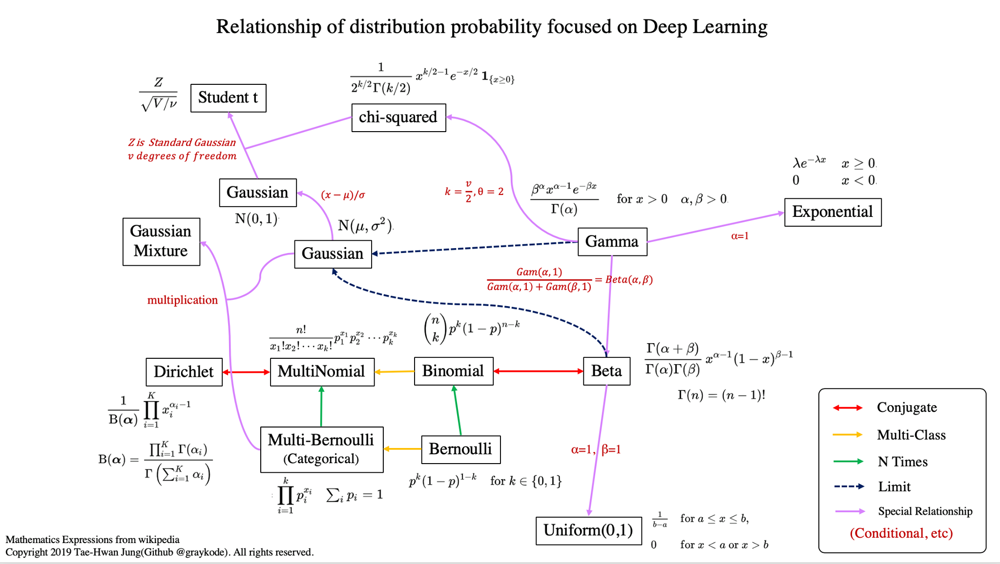
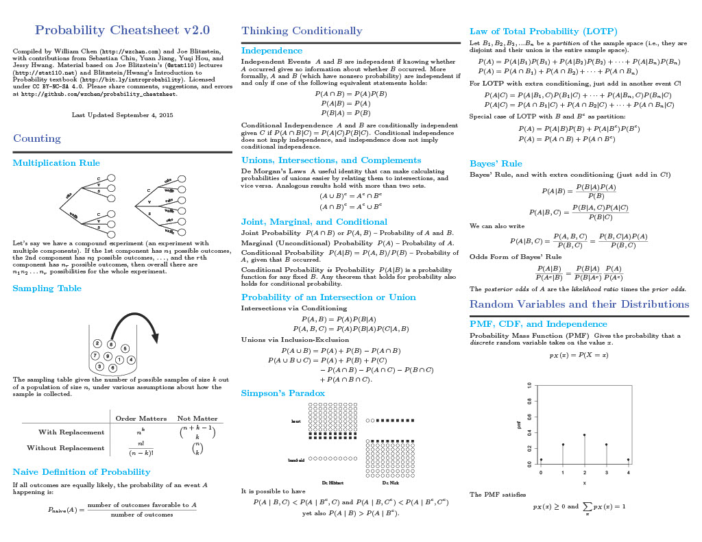
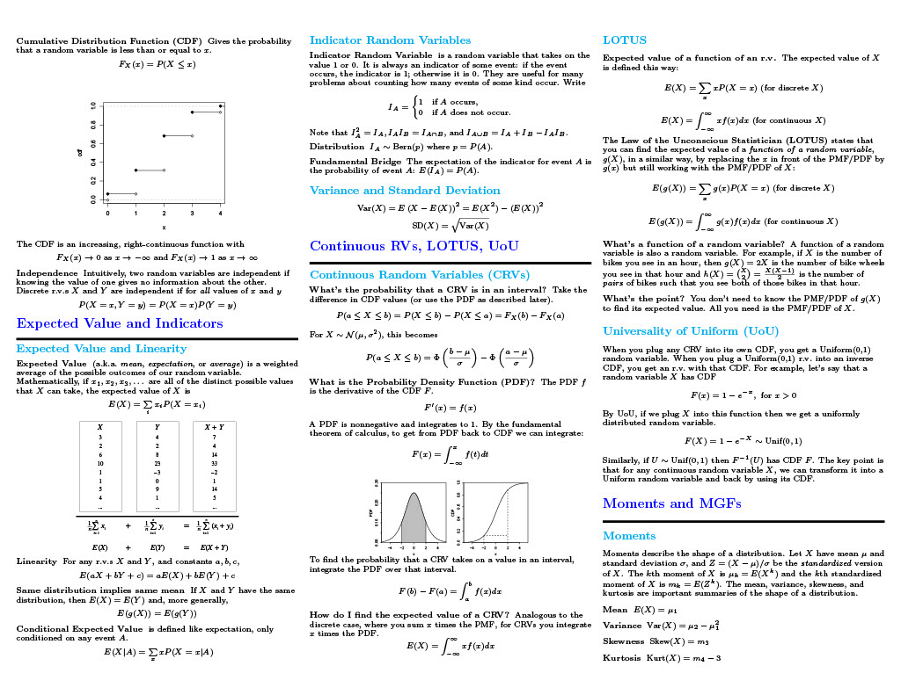
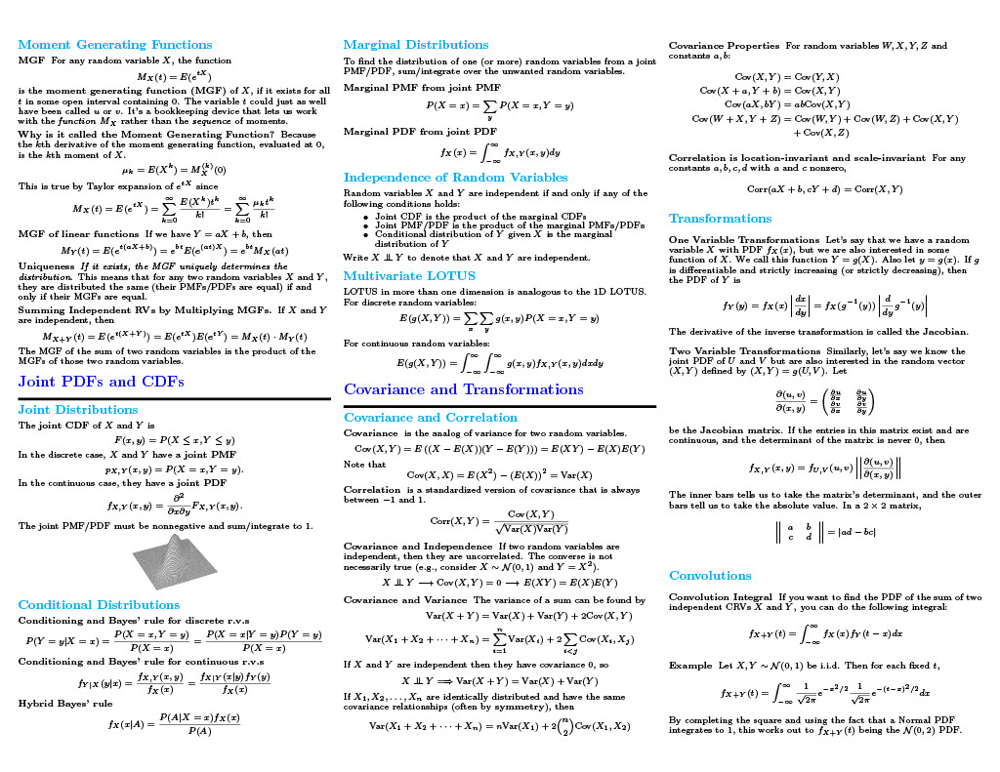
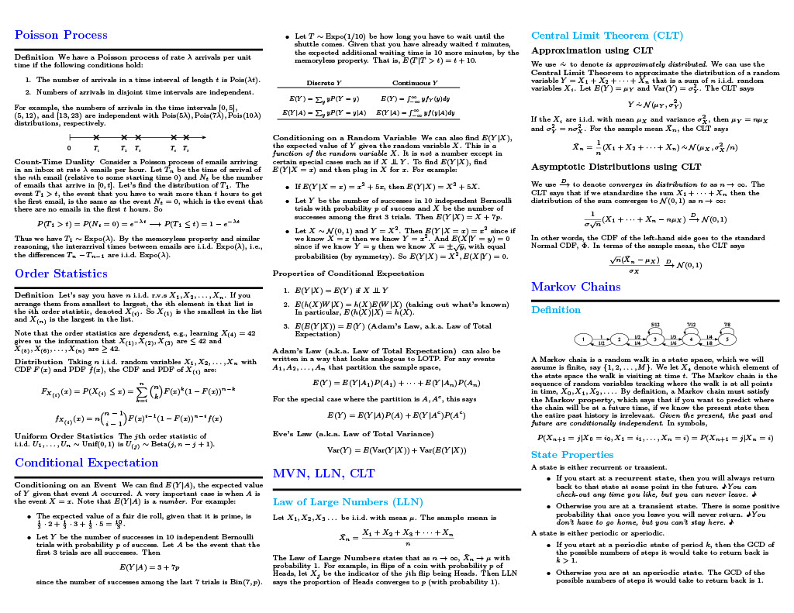
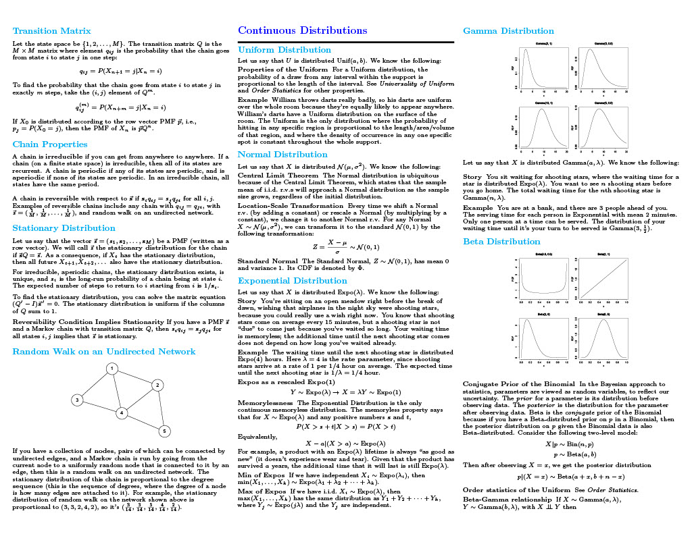
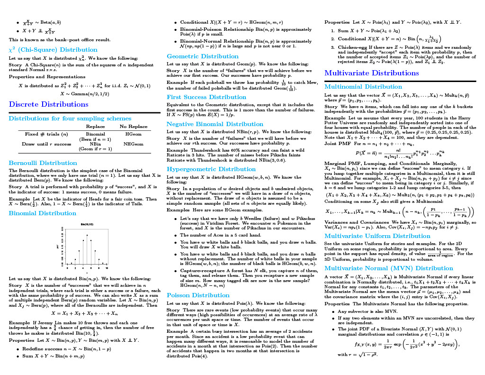
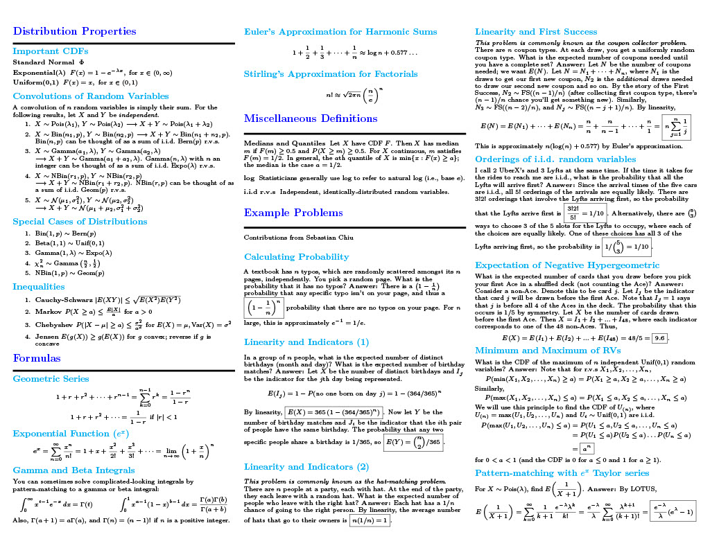
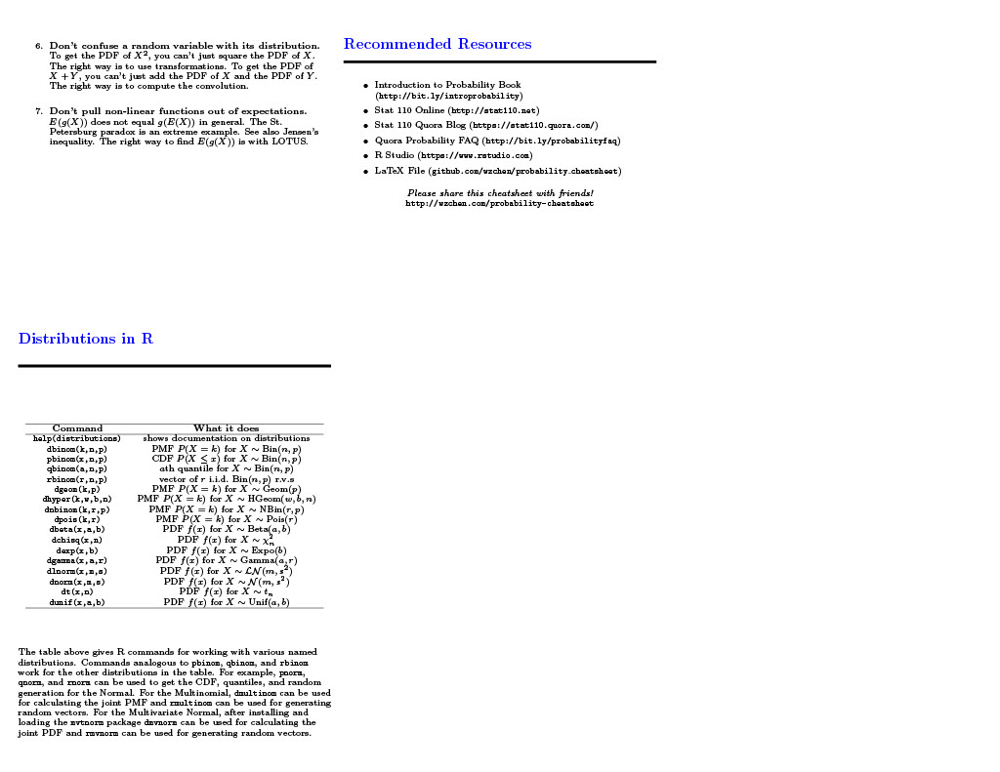
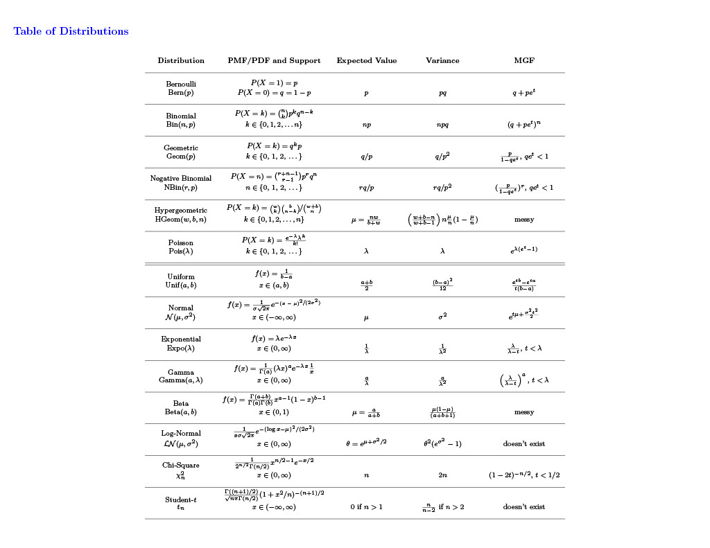

## Cheatsheet collection 
Cheatsheet collections for Math, A.I., Python libraries.   
Update frequently

## A.I. cheatsheet
### Deep Learning cheetsheet - Standford
**Author**: [Afshine Amidi](https://github.com/afshinea)  
+ [AI cheatsheet](https://github.com/quanghuy0497/cheatsheet-collection/blob/main/Standford-cheatsheet/super-cheatsheet-artificial-intelligence.pdf)
+ [ML cheatsheet](https://github.com/quanghuy0497/cheatsheet-collection/blob/main/Standford-cheatsheet/super-cheatsheet-machine-learning.pdf)
+ [DL cheatsheet](https://github.com/quanghuy0497/cheatsheet-collection/blob/main/Standford-cheatsheet/super-cheatsheet-deep-learning.pdf)

### The Machine Learning cheatsheet
**Author**: [Remicnrd](https://github.com/remicnrd/ml_cheatsheet)
+ [The Machine Learning cheatsheet](https://github.com/quanghuy0497/cheatsheet-collection/blob/main/Other-cheatsheet/Machine_Learning_Cheatsheet.pdf)

## Math cheatsheet
### Some image-cheatsheet stuff
+ **Activation functions**:  
  
+ **Distribution**:  
  Read [**here**](https://github.com/graykode/distribution-is-all-you-need) for more details, or try [**here**](https://github.com/quanghuy0497/Cheatsheet-collection/blob/main/cheatsheet-code/Distributions.ipynb) for the summary implementation code.  
  
+ **Optimization**:  
  Read [**here**](https://theaisummer.com/optimization/) for more details.  

### Probability Cheatsheet - Harvard's Stat 110
**Author**: Joe Blitzstein - Professor of Statistics at Harvard  
+ [Probability cheatsheet](http://www.wzchen.com/probability-cheatsheet/)
+ [Book](https://drive.google.com/file/d/1VmkAAGOYCTORq1wxSQqy255qLJjTNvBI/view)  

  

### Linear Algebra cheatsheet - Wisconsin-Mandison  
**Author**: Laurent Lessard  
+ [Linear Algebra cheatsheet](https://github.com/quanghuy0497/Cheatsheet-collection/blob/main/Wisconsin-Mandison-cheatsheet/Linear_Algebra_cheat_sheet.pdf)

### Statistic/Probability cheetsheet - Standford
**Author**: Shervine Amidi  
+ [Statistic cheatsheet](https://github.com/quanghuy0497/cheatsheet-collection/blob/main/Standford-cheatsheet/cheatsheet-statistics.pdf)
+ [Probability cheatsheet](https://github.com/quanghuy0497/cheatsheet-collection/blob/main/Standford-cheatsheet/cheatsheet-probability.pdf)

### Math for Computer Science - UIT
**Author**: Ngoc-Hoang Luong
+ [Math for Computer Science](https://github.com/quanghuy0497/Cheatsheet-collection/tree/main/Math-for-CS)
 
## Python cheatsheet
### Library cheatsheet
+ [Keras](https://github.com/quanghuy0497/Cheatsheet-collection/blob/main/Python-cheatsheet/Keras.pdf)
+ [Matplotlib](https://github.com/quanghuy0497/Cheatsheet-collection/blob/main/Python-cheatsheet/Matplotlib.pdf)
+ [Numpy](https://github.com/quanghuy0497/Cheatsheet-collection/blob/main/Python-cheatsheet/Numpy.pdf)
+ [Pandas](https://github.com/quanghuy0497/Cheatsheet-collection/blob/main/Python-cheatsheet/Pandas.pdf)
+ [SciPy](https://github.com/quanghuy0497/Cheatsheet-collection/blob/main/Python-cheatsheet/SciPy.pdf)
+ [Scikit-Learn](https://github.com/quanghuy0497/Cheatsheet-collection/blob/main/Python-cheatsheet/Scikit-Learn.pdf)

### Pytorch cheatsheet
+ [Pytorch cheatsheet](https://github.com/quanghuy0497/Cheatsheet-collection/blob/main/Pytorch-cheatsheet/cheatsheet_pytorch.pdf)
+ [Pytorch tutorial](https://github.com/quanghuy0497/Cheatsheet-collection/blob/main/Pytorch-cheatsheet/Pytorch_Tutorial.pdf)